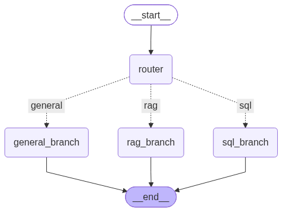
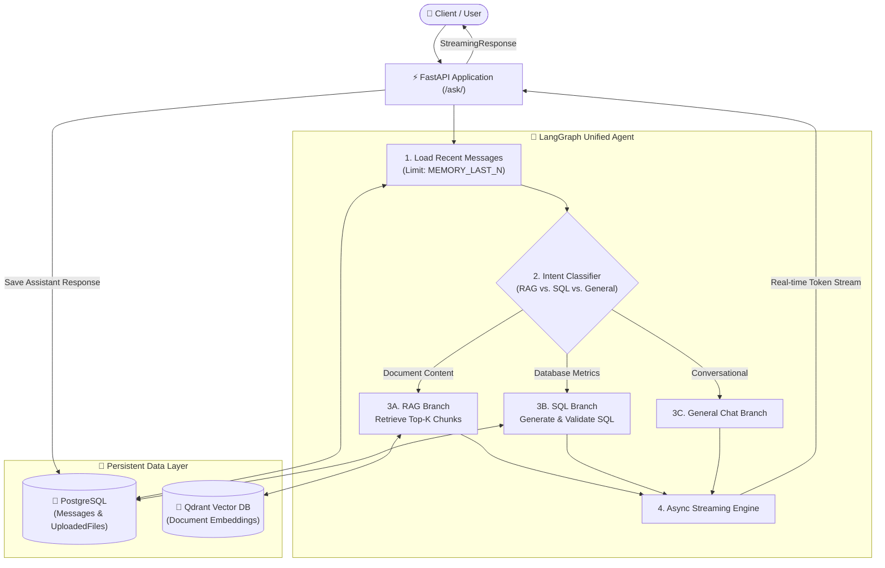

# Hybrid RAG & SQL Agent 🤖📊

[](https://www.python.org/)
[](https://fastapi.tiangolo.com/)
[](https://langchain-ai.github.io/langgraph/)
[](https://www.langchain.com/)
[](https://qdrant.tech/)
[](https://www.postgresql.org/)
[](https://www.docker.com/)
[](https://groq.com/)

An enterprise-grade **Hybrid AI Assistant** that unifies **Unstructured Semantic Search (PDF RAG)** and **Structured Relational Querying (Text-to-SQL)** into a single intelligent agent using **LangGraph**, **FastAPI**, **Qdrant**, and **PostgreSQL**.

---

## 🌟 Key Highlights

- **🧠 Agentic Conditional Routing:** An intelligent classifier node powered by LangGraph analyzes user intent and dynamically routes queries to either **Qdrant Vector RAG** (for document knowledge) or **PostgreSQL Text-to-SQL** (for metrics, metadata, and database analytics).
- **🛡️ Secure Text-to-SQL Guardrails:** Strict SQL validation that enforces **read-only `SELECT` queries**, preventing SQL injection and destructive statements (`DROP`, `DELETE`, `UPDATE`, `INSERT`, `ALTER`, `TRUNCATE`).
- **💬 Multi-Turn Conversation Memory:** Persistent chat history stored in PostgreSQL, dynamically feeding the last $N$ messages (configurable via `MEMORY_LAST_N` in `.env`) into the LLM context.
- **⚡ Real-Time Word-by-Word Streaming:** Powered by LangChain's `astream()` and FastAPI's `StreamingResponse` for instant response delivery.
- **🔄 Auto-Healing Vector Collections:** Automatically verifies and recreates missing Qdrant collections on-the-fly, eliminating runtime `404` errors.
- **📊 Enterprise Observability:** Dual-channel logging (stdout + rotating log files up to 5MB with 3 backups) in `logs/app.log`.
- **🐳 Full Microservices Containerization:** One-command startup orchestrating FastAPI, Qdrant, and PostgreSQL via Docker Compose.

---

## 🏗️ System Architecture

<p align="center">
  
  <br>
  <em>Compiled LangGraph StateGraph demonstrating conditional intent routing across RAG, Text-to-SQL, and General branches.</em>
</p>



---

## 🛠️ Tech Stack

| Component | Technology | Description |
| :--- | :--- | :--- |
| **Framework** | **FastAPI** | High-performance asynchronous REST API |
| **Agent Orchestration** | **LangGraph & LangChain** | State-driven multi-agent routing and LLM chaining |
| **LLM Inference** | **Groq Cloud (Llama 3 / GPT-OSS)** | Ultra-fast inference with deterministic sampling |
| **Embeddings** | **VoyageAI (`voyage-4-large`)** | State-of-the-art dense semantic text embeddings |
| **Vector Database** | **Qdrant** | Scalable vector search engine with cosine similarity |
| **Relational Database** | **PostgreSQL 15** | Async storage via SQLAlchemy 2.0 & `asyncpg` |
| **Document Processing** | **PyPDF & Text Splitters** | Document parsing and recursive character chunking |
| **Containerization** | **Docker & Docker Compose** | Reproducible multi-service deployment |

---

## 📁 Repository Structure

```text
├── clients/
│   ├── agent.py               # Unified LangGraph Agent & Conditional Router
│   ├── text_to_sql.py         # Text-to-SQL Graph, Prompts & Security Guardrails
│   ├── postgres_schema.py     # SQLAlchemy Async Models (Messages & UploadedFiles)
│   ├── qdrant.py              # Qdrant Client & Auto-Healing Collection Handler
│   ├── retriever.py           # Vector Store Retriever Setup
│   ├── ingestion_RAG.py       # PDF Loading & Recursive Chunking
│   └── generation.py          # RAG Generation Chain & Streaming Generator
├── helpers/
│   ├── config.py              # Pydantic Settings loaded from .env
│   └── logger.py              # Centralized Rotating Logger (Console + File)
├── routes/
│   └── data.py                # FastAPI Routes (/uploadfile/, /ask/, /ask-sql/)
├── Dockerfile                 # Multi-stage Python 3.11 Docker container
├── Docker-compose.yml         # Compose orchestration (API, Postgres, Qdrant)
├── requirements.txt           # Python dependencies
├── .env.example               # Sanitized environment configuration template
└── .gitignore                 # Secure Git exclusion rules
```

---

## 🚀 Quickstart Guide

### 1. Prerequisites
- [Docker Desktop](https://www.docker.com/products/docker-desktop/) installed and running.
- [Git](https://git-scm.com/) installed.

### 2. Clone the Repository
```bash
git clone https://github.com/SeifMahmoud63/Hybrid-RAG-SQL-Agent.git
cd Hybrid-RAG-SQL-Agent
```

### 3. Configure Environment Variables
Create your local `.env` file from the provided template:
```bash
cp .env.example .env
```
Edit `.env` and provide your API keys:
```env
GROQ_API_KEY="your_groq_api_key"
VOYAGE_API_KEY="your_voyage_api_key"
MEMORY_LAST_N=4
```

### 4. Build and Run via Docker Compose
```bash
docker compose up --build
```

The services will become available at:
- **FastAPI Interactive Docs (Swagger):** [http://localhost:8000/docs](http://localhost:8000/docs)
- **Qdrant Web Dashboard:** [http://localhost:6333/dashboard](http://localhost:6333/dashboard)
- **PostgreSQL Port:** `localhost:5433`

---

## 📡 API Endpoints Reference

### 1. Upload & Index Document
`POST /uploadfile/`
Uploads a PDF, automatically chunks the text, computes VoyageAI embeddings, stores vectors in Qdrant, and saves file metadata in PostgreSQL.

**Example cURL:**
```bash
curl -X POST "http://localhost:8000/uploadfile/" \
  -H "accept: application/json" \
  -F "file=@sample_report.pdf"
```

### 2. Unified Agent Query (Streaming & Memory)
`POST /ask/?query=...&stream=true`
The core intelligent endpoint. Automatically decides whether to query documents via **RAG** or database statistics via **Text-to-SQL**, while recalling conversation context.

**Example Queries:**
- **Document Query (Routes to RAG):**
  > *"What are the main responsibilities mentioned in the CV?"*
- **Database Query (Routes to SQL):**
  > *"How many files are currently uploaded and what are their total sizes?"*
- **Conversational Query (Routes to General):**
  > *"Hello, can you explain what tools you have access to?"*

---

## 🔒 Security & Guardrails

- **Read-Only Enforced:** The Text-to-SQL generator accepts only `SELECT` and `WITH` statements. Any destructive operations (`DROP`, `DELETE`, `UPDATE`, `INSERT`, `TRUNCATE`, `ALTER`) are immediately rejected.
- **SQL Injection Prevention:** Queries containing statement stacking (`;`) are automatically blocked.
- **Secret Hygiene:** All API keys and environment files are strictly isolated from source control via `.gitignore`.

---

## 👤 Author

**Seif Mahmoud**  
- GitHub: [@SeifMahmoud63](https://github.com/SeifMahmoud63)
- Project Repository: [Hybrid-RAG-SQL-Agent](https://github.com/SeifMahmoud63/Hybrid-RAG-SQL-Agent)

---

## 📄 License
This project is licensed under the MIT License - see the [LICENSE](LICENSE) file for details.
